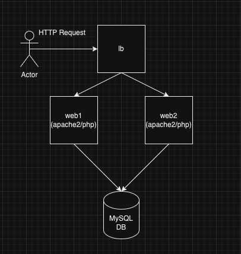

## Architecture 




## Description
This repository contains scripts and configurations for provisioning and monitoring a cloud-based (DigitalOcean) infrastructure.

## Components
- **Terraform Configuration (`*.tf` files)**: Includes `db.tf`, `loadbalancer.tf`, `provider.tf`, `web1.tf`, and `web2.tf` for provisioning and managing infrastructure components.
- **Apache Monitoring Script (`apache_monitoring.sh`)**: Bash script for monitoring the Apache server status. The script is automatically added as a cronjob and runs every 2 minutes.
- **Python Script (`droplet_restart.py`)**: Polls the status of the 2 apache servers and restarts the droplets if 3 consecutive checks fail.
- **Database Query (`query.sql`)**: Creates a DB & a table and inserts some records.
- **PHP Index File (`index.php`)**: Simple PHP script that connects to the DB and displays the records of the specified table. It also includes a 'Hello from <webserver_num>' message indicating which server the loadbalancer redirected the request to. 

## Dependencies
- **Bash**: For apache2 monitoring shell script.
- **Terraform**: For infrastructure as code to provision and manage cloud resources.
- **Python**: For executing restart on droplets.
- **MySQL**: SQL script execution for creating DB/table.
- **Apache/PHP**: For hosting basic web applications.

## Setup
1. **Clone the Repository**:
   ```bash
   git clone https://github.com/joanatanasoff/tasks.git
   cd tasks/task2
   export TF_VAR_do_token="DO_API_TOKEN"
   terraform init
   terraform apply

1.1 Variable for droplet_restart.py:
    In order to run the script, add: 
    ```bash
    export DIGITALOCEAN_TOKEN="DO_API_TOKEN"

